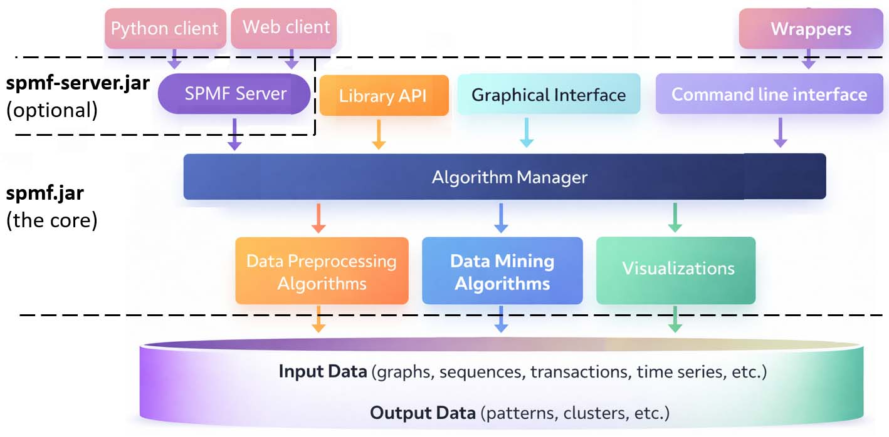

[](https://github.com/philfv9/spmf-software/blob/main/LICENSE)
[](https://github.com/philfv9/spmf-software/releases/latest)
[](https://github.com/philfv9/spmf-software/stargazers)
[]()
[](http://www.philippe-fournier-viger.com/spmf/)

<div align="center">
  <h1>The SPMF Open-Source Pattern Mining Sofware</h1>
  
</div>

**[SPMF](http://philippe-fournier-viger.com/spmf/)** is a popular and highly efficient **data mining software** written in **Java**, specialized in **pattern mining**. It provides over **300 algorithms** for various tasks such as:

- Frequent itemset mining
- Association rule mining
- Sequential pattern mining
- Sequential rule mining
- High-utility itemset mining
- Episode mining
- Graph mining
- Time series analysis
- and more

SPMF offers a graphical user interface (GUI), a command-line interface (CLI), and a server for alternatively running data mining algorithms through REST queries from a Python or Web client. SPMF can also be integrated in Python, R and other languages through wrappers and its CLI, or used as a Java library in Java projects.  SPMF is lightweight, actively developed and has **no external dependencies**.

The latest release is **SPMF version v2.65**, released on February 18, 2026.

The **official website of SPMF** with full documentation, tutorials, and other resources is:  [http://philippe-fournier-viger.com/spmf/](http://philippe-fournier-viger.com/spmf/)

---

## Table of Contents

- [Quickstart](#quickstart)
- [Documentation](#documentation)
- [Datasets](#datasets)
- [Architecture](#architecture)
- [How to learn more?](#how-to-learn-more)
- [Contributing](#contributing)
- [License](#license)
- [How to Cite SPMF](#how-to-cite-spmf)
- [Authors](#authors)

---

## Quickstart

There are five ways to use SPMF, depending on your needs:

---

### 1 — Graphical User Interface (GUI)

<div align="center">
  
</div>

The most simple way to use SPMF is through its integrated GUI.  To run the GUI:
1) Download the files `spmf.jar` and `test_files.zip` to your computer and make sure that Java is installed on your computer.
2) Uncompress the file `test_files.zip` on your desktop. It will create a folder containing some example data files that you can use with the algorithms.
3) Launch the GUI of SPMF by double-clicking on the file `spmf.jar`. If it does not work and you are using Windows, right-click on `spmf.jar` and select "open with..." and then select "Java Platform". If this option is not there, perhaps that Java is not installed on your computer, or that the PATH environment variable does not include your Java installation. 
4) If the previous step succeeds, the graphical interface of SPMF will open. 

<div align="center">
  
</div>

5) Then, from the user interface, you can select input files, choose an algorithm from more than 300 algorithms, sets its parameters, and run the algorithms. For example, let's say that you want to run the **CM-SPAM** algorithm.   In the [documentation](https://philippe-fournier-viger.com/spmf/index.php?link=documentation.php), it is the [CM-SPAM example](https://philippe-fournier-viger.com/spmf/CM-SPAM.php). To run that example:
   
 - Click on the combo box beside **"Choose an algorithm"** and select **"CM-SPAM"**.  
 - Click on **"Choose input file"** and select `contextPrefixSpan.txt` from the `test_files` folder.  
 - Click on **"Choose output file"**, select a location (e.g., Desktop), enter `result.txt`, and click **"OK"**.
 - Set the parameter **minsup (%)** to `0.5` (as in the example).  
 - Other parameters are optional and can be ignored for this example.  
 - Click on **"Run algorithm"**.  
 - A new window will open showing the results.  
 - The results correspond to the patterns discovered by CM-SPAM (see the [CM-SPAM example](https://philippe-fournier-viger.com/spmf/CM-SPAM.php) of the documentation for interpretation).
That’s all. To run another algorithm, follow the same steps.

---

### 2 — Command Line

<div align="center">
  
</div>

The second to use SPMF is through its command line interface (CLI) from the console.  To run the SPMF using the CLI:
1) Download the files `spmf.jar` and `test_files.zip` to your computer and make sure that Java is installed on your computer.
2) Uncompress the file `test_files.zip` on your desktop. It will create a folder containing some example data files that you can use with the algorithms.
3) To run an algorithm, go to the [documentation](https://philippe-fournier-viger.com/spmf/index.php?link=documentation.php) of SPMF  find the example corresponding to the algorithm that you want to run. For example, let's say that you want to run the **PrefixSpan** algorithm. It is this [example](https://philippe-fournier-viger.com/spmf/PrefixSpan.php) in the [documentation](https://philippe-fournier-viger.com/spmf/index.php?link=documentation.php).
5) Open the command prompt (if you are using Windows) or the terminal (if you are using Linux). Then, type the command specified in the example. For example, for PrefixSpan, the command is:
   
    ```java -jar spmf.jar run PrefixSpan contextPrefixSpan.txt output.txt 50%```
  
This command means to run the algorithm named "PrefixSpan" to use the input file named "contextPrefixSpan.txt" to set the output file for the results as "output.txt" to set the parameter of the algorithm (minsup) to 50 %. After executing this command, the file output.txt will be created. It will contain the result.

<div align="center">
  
</div>


The input and output file format of each algorithm is described in the  [documentation](https://philippe-fournier-viger.com/spmf/index.php?link=documentation.php).

That's all. If you want to run another algorithm, then follow the same steps.

---

### 3 — Java API

<div align="center">
  
</div>

The third way to use SPMF is by integrating it into Java projects. For this, you can download `spmf.jar` and include it in the classpath of your Java project, and then call the classes from SPMF from your Java program. Or alternatively, you can download `spmf.zip` or clone the project to obtain SPMF source code. 
To get a good grasp of how the source code of SPMF is organized, you may read the [developers guide](http://philippe-fournier-viger.com/spmf/index.php?link=developers.php).

In general, each algorithm in SPMF is organized in its own package containing the main implementation files. Some utility classes are shared across multiple algorithms and are located in common directories such as `ca/pfv/spmf/input/` and `ca/pfv/spmf/patterns/`.  To how to run one algorithm from the source code, consider the SPAM algorithm. It is implemented in the package `ca/pfv/spmf/algorithms/sequentialpatterns/spam`, which is itself a subpackage of `ca/pfv/spmf/algorithms/sequentialpatterns/`, reflecting the fact that SPAM belongs to the family of sequential pattern mining algorithms. 

Each algorithm follows a consistent design pattern. There is a main class whose name starts with `Algo`, and this class provides a method called `runAlgorithm()` to execute the algorithm. For example, the SPAM algorithm is implemented in the class `AlgoSPAM.java`. Its `runAlgorithm()` method expects three parameters: the path to the input file, the path to the output file, and a minimum support threshold.
To understand how an algorithm is executed in practice, one can examine the example files located in the directory `ca/pfv/spmf/test/`. This directory contains demonstration code intended for developers. Each algorithm typically has at least one corresponding test file named `MainTestXXXX.java`, where `XXXX` is the name of the algorithm. 

In the case of SPAM, the relevant example is `MainTestSPAM_saveToFile.java`.

Example code of how to run the SPAM algorithm:

```java
// Load a sequence database
String input = fileToPath("contextPrefixSpan.txt");
String output = ".//output.txt";

// Create an instance of the algorithm
AlgoSPAM algo = new AlgoSPAM();

// Execute the algorithm with minsup = 2 sequences (50%)
algo.runAlgorithm(input, output, 0.5);
algo.printStatistics();
```

In this example, the input file `contextPrefixSpan.txt` corresponds to the dataset used in the official documentation and can be found in the `ca/pfv/spmf/tests/` directory. The output file is written to `.//output.txt`, although this path can be replaced by any valid location on the user’s system. The call to `runAlgorithm()` triggers the execution of the algorithm. The value `0.5` represents the minimum support threshold, whose exact interpretation is described in the SPAM documentation. Finally, each algorithm is associated with a description class located in the package `ca/pfv/spmf/algorithmmanager/descriptions`. These classes provide metadata such as the authors of the algorithm, the expected input and output formats, the list of parameters, and instructions for execution. They play an important role in the system: the graphical user interface relies on them to dynamically populate the list of available algorithms, while the command-line interface uses them to inform users about the required parameters and usage details. For instance, the SPAM algorithm is documented by the class `DescriptionAlgoSPAM`.
Other algorithms can be run in a similar way.

The input and output file format of each algorithm is described in the  [documentation](https://philippe-fournier-viger.com/spmf/index.php?link=documentation.php).

---

### 4 — Wrappers for Other Languages

<div align="center">
  
</div>

The fourth way to use SPMF is to call it from language developed using other programming languages using   wrappers for **Python, R, C#, etc.** via community-provided wrappers that invoke the command-line interface of SPMF.
A list of wrappers is [here](https://www.philippe-fournier-viger.com/spmf/index.php?link=spmfwrappers.php).

---

### 5 — REST API via SPMF-Server *(new)*

<div align="center">
  
</div>

The fifth way to use SPMF is through the **[SPMF-Server](https://github.com/philfv9/spmf-server)**, a lightweight
HTTP server that wraps the SPMF library and exposes all algorithms as a **REST API**. This lets any language or tool submit mining jobs over HTTP and retrieve results without needing a local Java integration. This can be useful to run SPMF on a remote machine and query it from a client, from the browser or integrate it into a web application or microservice. 
Currently, the SPMF server can be used with the [SPMF Server Python CLI and GUI clients](https://github.com/philfv9/spmf-server-pythonclient) or  the [SPMF Server Web client](https://github.com/philfv9/spmf-server-webclient). For more details about how to install and run the SPMF-Server, please see the [SPMF-Server](https://github.com/philfv9/spmf-server) project.

## Documentation

The main documentation of SPMF and other resources can be found on the SPMF website. 
- **List of algorithms:**
  [https://philippe-fournier-viger.com/spmf/index.php?link=algorithms.php](https://philippe-fournier-viger.com/spmf/index.php?link=algorithms.php)
- **Main documentation** (with examples for each algorithm):
  [https://philippe-fournier-viger.com/spmf/index.php?link=documentation.php](https://philippe-fournier-viger.com/spmf/index.php?link=documentation.php)
- **Release notes and download**
  [download page](https://philippe-fournier-viger.com/spmf/index.php?link=download.php)
- **FAQ:**
  [https://philippe-fournier-viger.com/spmf/index.php?link=FAQ.php](https://philippe-fournier-viger.com/spmf/index.php?link=FAQ.php)


---

## Datasets

To run experiments with SPMF, multiple datasets are provided on the SPMF website, in SPMF format:
[https://philippe-fournier-viger.com/spmf/index.php?link=datasets.php](https://philippe-fournier-viger.com/spmf/index.php?link=datasets.php)

---

## Architecture

A general overview of the architecture of SPMF is provided below.

<div align="center">
  
</div>

To use SPMF, a user can choose to use the Graphical interface, Command line interface or the SPMF-server. The user interacts with any of these interfaces to run algorithms which are managed by a module called the Agorithm Manager. There are mainly three types of algorithms, which are (1) data pre-processing algorithms, (2) data mining algorithms, and (3) algorithms to either visualize data or patterns found in the data. The Algorithm Manager has the list of all available algorithms, and a description of each algorithm. The description of an algorithm indicates how many parameters it has, what are the data  types of parameters, what is the algorithm name, etc. The input and output of algorithms are generally text files. A few different formats are supported, explained in the documentation of SPMF.

The source code is organized in several packages. The main packages are:
```
ca.pfv.spmf/
│
├── algorithms/
│   ├── associationrules/        → Association rule mining algorithms
│   ├── classifiers/             → Classification algorithms
│   ├── clustering/              → Clustering algorithms
│   ├── episodes/                → Episode mining algorithms
│   ├── frequentpatterns/        → Itemset mining algorithms
│   ├── graph_mining/            → Graph mining algorithms
│   ├── sequenceprediction/      → Sequence prediction algorithms
│   ├── sequential_rules/        → Sequential rule mining algorithms
│   ├── sequentialpatterns/      → Sequential pattern mining algorithms
│   ├── sort/                    → Sorting algorithms
│   └── timeseries/              → Time series mining & analysis algorithms
│
├── algorithmmanager/
│   ├── Algorithm Manager        → Central registry for algorithms
│   └── descriptions/            → Metadata (input/output types, authors, etc.)
│
├── datastructures/              → Specialized data structures (e.g., triangular matrix)

├── gui/                         → Graphical User Interface (MainWindow.java)
│   └── Main.java                → Command-line entry point
│
├── input/                       → Input file readers (transactions, sequences, etc.)
│
├── patterns/                    → Pattern representations (itemsets, rules, etc.)
│
├── test/                        → Example usage of algorithms (developer samples, not unit tests)
│
└── tools/                       → Utilities (generators, converters, statistics, etc.)
```
---

## How to Learn More?

- [The SPMF website](http://philippe-fournier-viger.com/spmf/)
- [The Data Blog](https://data-mining.philippe-fournier-viger.com/) — Blog from the founder of SPMF
- [Other Resources](https://www.philippe-fournier-viger.com/spmf/index.php?link=resources.php) — Books, tutorials, links to other projects, etc.

If you want to learn  about the theory Pattern Mining, watch the free [Pattern Mining Course](https://www.philippe-fournier-viger.com/COURSES/Pattern_mining/index.php) course:

<a href="https://www.philippe-fournier-viger.com/COURSES/Pattern_mining/index.php"></a>

and also check out the [@philfv YouTube channel](https://www.youtube.com/@philfv)

<a href="https://www.youtube.com/@philfv"></a>

---

## Contributing

If you would like to contribute improvements, please contact the SPMF founder
at **philfv AT qq DOT com**. In particular, if you want to contribute new
algorithms not yet implemented in SPMF, you are very welcome to get in touch.

See the [contributors page](https://www.philippe-fournier-viger.com/spmf/index.php?link=contributors.php)
for a full list of people who have contributed to the project.

---

## License

The source code and files in this project are licensed under the **GNU General Public License v3.0 (GPLv3)**.
The GPL license grants four freedoms:

1. Run the program for any purpose
2. Access the source code
3. Modify the source code
4. Redistribute modified versions

**Restrictions:** If you redistribute the software (or derivative works), you must:

- Provide access to the source code
- License derivative works under the same GPLv3 license
- Include prominent notices stating that you modified the code, along with the modification date

For full details about the license and its requirements, see the [GPLv3 license](https://www.gnu.org/licenses/gpl-3.0.en.html).

---

## How to Cite SPMF

If you use SPMF in your research, please cite one of the following papers:

- Fournier-Viger, P., et al. (2012). *SPMF: A Java Open-Source Pattern Mining Library.  Journal of Machine Learning Research (JMLR).

- Fournier-Viger, P., Lin, C.W., Gomariz, A., Gueniche, T., Soltani, A., Deng, Z., Lam, H. T. (2016). *The SPMF Open-Source Data Mining Library Version 2.*  In Proceedings of the 19th European Conference on Principles of Data Mining and Knowledge Discovery (PKDD 2016), Part III, Springer LNCS 9853, pp. 36–40.

For a full list of citations, see the
[citations page](https://www.philippe-fournier-viger.com/spmf/index.php?link=citations.php).
Citing SPMF helps support the project — thank you! 🙏

---

## Authors

**Project Leaders:**

- **Prof. Philippe Fournier-Viger** (Founder), 
  [https://www.philippe-fournier-viger.com/](https://www.philippe-fournier-viger.com/)
  (e-mail: philfv AT qq DOT com)
- **Prof. Jerry Chun-Wei Lin**
- **Prof. Wei Song** — North China University of Technology, Beijing, China
- **Prof. Vincent S. Tseng** — National Chiao Tung University, Taiwan
- **Prof. Ji Zhang** — University of Southern Queensland, Australia, 
  [https://staffprofile.unisq.edu.au/Profile/Ji-Zhang](https://staffprofile.unisq.edu.au/Profile/Ji-Zhang)

**Contributors:**
A full list of all contributors can be found at:
[https://www.philippe-fournier-viger.com/spmf/index.php?link=contributors.php](https://www.philippe-fournier-viger.com/spmf/index.php?link=contributors.php)

The content of this page is copyright Philippe Fournier-Viger and contributors
