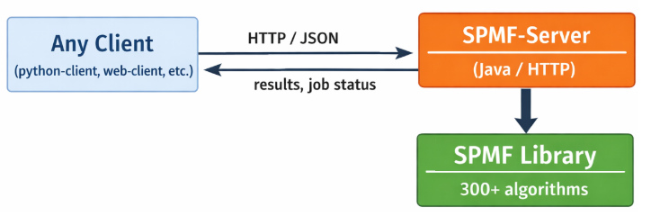
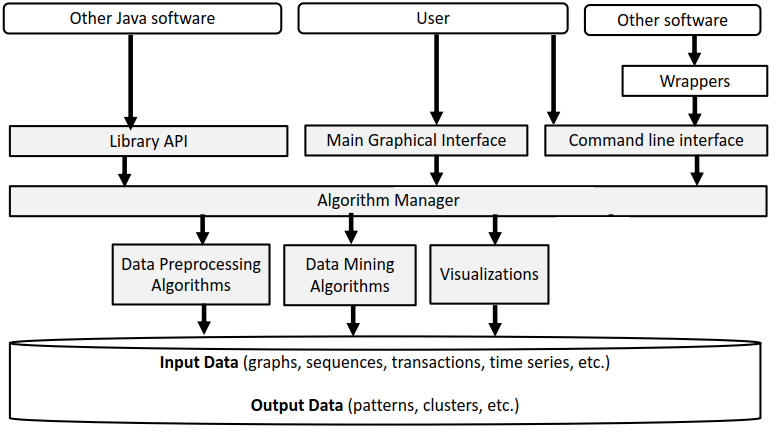

[](https://github.com/philfv9/spmf-software/blob/main/LICENSE)
[](https://github.com/philfv9/spmf-software/releases/latest)
[](https://github.com/philfv9/spmf-software/stargazers)
[]()
[](http://www.philippe-fournier-viger.com/spmf/)

<div align="center">
  <h1>The SPMF Open-Source Pattern Mining Sofware</h1>
  
</div>

**[SPMF](http://philippe-fournier-viger.com/spmf/)** is a popular and highly efficient **data mining software** written in **Java**, specialized in **pattern mining**. It provides over **300 algorithms** for various tasks such as:

- Frequent itemset mining
- Association rule mining
- Sequential pattern mining
- Sequential rule mining
- High-utility itemset mining
- Episode mining
- Graph mining
- Time series analysis
- and more

SPMF offers a graphical user interface (GUI), a command-line interface, and a server for alternatively running data mining algorithms through REST queries from a Python or Web client. SPMF can also be integrated in Python, R and other languages through wrappers and its CLI, or used as a Java library in Java projects.  SPMF is lightweight, actively developed and has **no external dependencies**.

The latest release is **SPMF version v2.65**, released on February 18, 2026.

The **official website of SPMF** with full documentation, tutorials, and other resources is:  [http://philippe-fournier-viger.com/spmf/](http://philippe-fournier-viger.com/spmf/)

---

## Table of Contents

- [Quickstart](#quickstart)
- [Documentation](#documentation)
- [Datasets](#datasets)
- [Architecture](#architecture)
- [Screenshots](#screenshots)
- [Related Resources](#related-resources)
- [Contributing](#contributing)
- [License](#license)
- [How to Cite SPMF](#how-to-cite-spmf)
- [Authors](#authors)

---

## Quickstart

There are five ways to use SPMF, depending on your needs:

---

### 1 — Graphical User Interface (GUI)

<div align="center">
  
</div>

The most simple way to use SPMF is through its integrated graphical user interface.  To run SPMF, you need to have a recent version of Java installed on your computer. Then:
1) Ddownload the files `spmf.jar` and `test_files.zip` to your computer
2) Uncompress the file `test_files.zip` on your desktop. It will create a folder containing some example data files that you can use with the algorithms.
3) To run the SPMF software, now double-click on the file `spmf.jar`. It will launch the software. If it does not work and you are using Windows, right-click on `spmf.jar` and select "open with..." and then select "Java Platform". If this option is not there, perhaps that Java is not installed on your computer, or that the PATH environment variable does not include your Java installation. 
4) If the previous step succeeds, the graphical interface of SPMF will open. 

<div align="center">
  
</div>
5)  Then, from the user interface, you can select input files, choose an algorithm from more than 300 algorithms, sets its parameters, and run the algorithms.
   For example, let's say that you want to run the **CM-SPAM** algorithm.
  * In the [documentation](https://philippe-fournier-viger.com/spmf/index.php?link=documentation.php), it is the [CM-SPAM example](https://philippe-fournier-viger.com/spmf/CM-SPAM.php). To run that example: Click on the combo box beside "Choose an algorithm" to select "CM-SPAM".
  * After that, click on the button "Choose input file". This will open a dialog to select the input file.
  * Go to the test_files folder on your desktop and select the file "contextPrefixSpan.txt" (the file to be used is indicated in the CM-SPAM example).
  * Now, click on the button "Choose output file" to select where the result should be saved. For example, go to the desktop and write "result.txt" and click "OK".
  * The next step is to set the parameter minsup of the CM-SPAM algorithm. To do that, click in the text box beside "Choose minsup (%)" and enter 0.5 because it is the value used in the CM-SPAM example. There are also parameters but they are optional. Thus we do not need to use them for this example.
  * After that, click on "Run algorithm" to run the algorithm.
  * A new window will open showing the result.
  * These results are the patterns discovered by CM-SPAM. These results are explained in the CM-SPAM example of the [documentation](https://philippe-fournier-viger.com/spmf/index.php?link=documentation.php).
  * That's all. If you want to run another algorithm, then follow the same steps.

---

### 2 — Command Line

Run any algorithm directly from the terminal without opening the GUI:

<div align="center">
  
</div>

For example: 

```bash
java -jar spmf.jar run Apriori input.txt output.txt 0.4
```

See the [documentation](https://philippe-fournier-viger.com/spmf/index.php?link=documentation.php)
for the full command-line syntax for each algorithm.

---

### 3 — Java API

Integrate SPMF algorithms directly into your Java project by calling the
algorithm classes programmatically. No external dependencies are required —
just add `spmf.jar` to your classpath.

<div align="center">
  
</div>

See the [documentation](https://philippe-fournier-viger.com/spmf/index.php?link=documentation.php)
for Java API usage examples.

---

### 4 — Wrappers for Other Languages

SPMF can be called from **Python, R, C#, and more** via community-provided
wrappers that invoke the command-line interface:

<div align="center">
  
</div>

👉 [SPMF Wrappers page](https://www.philippe-fournier-viger.com/spmf/index.php?link=spmfwrappers.php)

---

### 5 — REST API via SPMF-Server *(new)*

**[SPMF-Server](https://github.com/philfv9/spmf-server)** is a lightweight
HTTP server that wraps the SPMF library and exposes all algorithms as a
**REST API**. This lets any language or tool submit mining jobs over HTTP and
retrieve results without needing a local Java integration.

<div align="center">
  
</div>

This can be useful to run SPMF on a remote machine and query it from a client, from the browser or integrate it into a web application or microservice. 
Currently, the SPMF server can be used with the [SPMF Server Python CLI and GUI clients](https://github.com/philfv9/spmf-server-pythonclient) or  the [SPMF Server Web client](https://github.com/philfv9/spmf-server-webclient).

## Documentation

- **Installation and quick start:**
  [download page](https://philippe-fournier-viger.com/spmf/index.php?link=download.php)

- **Main documentation** (with examples for each algorithm):
  [https://philippe-fournier-viger.com/spmf/index.php?link=documentation.php](https://philippe-fournier-viger.com/spmf/index.php?link=documentation.php)

- **FAQ:**
  [https://philippe-fournier-viger.com/spmf/index.php?link=FAQ.php](https://philippe-fournier-viger.com/spmf/index.php?link=FAQ.php)

- **List of algorithms:**
  [https://philippe-fournier-viger.com/spmf/index.php?link=algorithms.php](https://philippe-fournier-viger.com/spmf/index.php?link=algorithms.php)

---

## Datasets

Datasets in SPMF format are available on the SPMF website:
[https://philippe-fournier-viger.com/spmf/index.php?link=datasets.php](https://philippe-fournier-viger.com/spmf/index.php?link=datasets.php)

---

## Architecture

A general overview of the architecture of SPMF is provided below.

<div align="center">
  
</div>

To use SPMF, a user can choose to use the Graphical interface, Command line interface or the SPMF-server. The user interacts with any of these interfaces to run algorithms which are managed by a module called the Agorithm Manager. There are mainly three types of algorithms, which are (1) data pre-processing algorithms, (2) data mining algorithms, and (3) algorithms to either visualize data or patterns found in the data. The Algorithm Manager has the list of all available algorithms, and a description of each algorithm. The description of an algorithm indicates how many parameters it has, what are the data  types of parameters, what is the algorithm name, etc. The input and output of algorithms are generally text files. A few different formats are supported, explained in the documentation of SPMF.

The source code is organized in several packages. The main packages are:
```
ca.pfv.spmf/
│
├── algorithms/
│   ├── associationrules/        → Association rule mining algorithms
│   ├── classifiers/             → Classification algorithms
│   ├── clustering/              → Clustering algorithms
│   ├── episodes/                → Episode mining algorithms
│   ├── frequentpatterns/        → Itemset mining algorithms
│   ├── graph_mining/            → Graph mining algorithms
│   ├── sequenceprediction/      → Sequence prediction algorithms
│   ├── sequential_rules/        → Sequential rule mining algorithms
│   ├── sequentialpatterns/      → Sequential pattern mining algorithms
│   ├── sort/                    → Sorting algorithms
│   └── timeseries/              → Time series mining & analysis algorithms
│
├── algorithmmanager/
│   ├── Algorithm Manager        → Central registry for algorithms
│   └── descriptions/            → Metadata (input/output types, authors, etc.)
│
├── datastructures/              → Specialized data structures (e.g., triangular matrix)

├── gui/                         → Graphical User Interface (MainWindow.java)
│   └── Main.java                → Command-line entry point
│
├── input/                       → Input file readers (transactions, sequences, etc.)
│
├── patterns/                    → Pattern representations (itemsets, rules, etc.)
│
├── test/                        → Example usage of algorithms (developer samples, not unit tests)
│
└── tools/                       → Utilities (generators, converters, statistics, etc.)
```
---

## Screenshots

<div align="center">
  
  <br>
  <em>SPMF Graphical User Interface</em>
</div>

---

## Related Resources

- [The SPMF website](http://philippe-fournier-viger.com/spmf/)
- [SPMF-Server](https://github.com/philfv9/spmf-server) — REST API server for SPMF
- [SPMF Server Python client](https://github.com/philfv9/spmf-server-pythonclient) — Python CLI and GUI clients for SPMF-Server
- [SPMF Server Web client](https://github.com/philfv9/spmf-server-webclient). A Web client (HTML+JS+CSS) for the SPMF-Server
- [The Pattern Mining Course](https://data-mining.philippe-fournier-viger.com/COURSES/Pattern_mining/index.php) — A free online course covering pattern mining algorithms and their implementation
- [More Pattern Mining Videos on the @philfv YouTube channel](https://www.youtube.com/@philfv)
- [The Data Blog](https://data-mining.philippe-fournier-viger.com/) — Blog from the founder of SPMF
- [Other Resources](https://www.philippe-fournier-viger.com/spmf/index.php?link=resources.php) — Books, tutorials, links to other projects, etc.

---

## Contributing

If you would like to contribute improvements, please contact the SPMF founder
at **philfv AT qq DOT com**. In particular, if you want to contribute new
algorithms not yet implemented in SPMF, you are very welcome to get in touch.

See the [contributors page](https://www.philippe-fournier-viger.com/spmf/index.php?link=contributors.php)
for a full list of people who have contributed to the project.

---

## License

This project is licensed under the **GNU General Public License v3.0 (GPLv3)**.
The GPL license grants four freedoms:

1. Run the program for any purpose
2. Access the source code
3. Modify the source code
4. Redistribute modified versions

**Restrictions:** If you redistribute the software (or derivative works), you must:

- Provide access to the source code
- License derivative works under the same GPLv3 license
- Include prominent notices stating that you modified the code, along with the modification date

For full details, see the [GPLv3 license](https://www.gnu.org/licenses/gpl-3.0.en.html).

---

## How to Cite SPMF

If you use SPMF in your research, please cite one of the following papers:

- Fournier-Viger, P., et al. (2012). *SPMF: A Java Open-Source Pattern Mining Library.  Journal of Machine Learning Research (JMLR).

- Fournier-Viger, P., Lin, C.W., Gomariz, A., Gueniche, T., Soltani, A., Deng, Z., Lam, H. T. (2016). *The SPMF Open-Source Data Mining Library Version 2.*  In Proceedings of the 19th European Conference on Principles of Data Mining and Knowledge Discovery (PKDD 2016), Part III, Springer LNCS 9853, pp. 36–40.

For a full list of citations, see the
[citations page](https://www.philippe-fournier-viger.com/spmf/index.php?link=citations.php).
Citing SPMF helps support the project — thank you! 🙏

---

## Authors

**Project Leaders:**

- **Prof. Philippe Fournier-Viger** (Founder), 
  [https://www.philippe-fournier-viger.com/](https://www.philippe-fournier-viger.com/)
  (e-mail: philfv AT qq DOT com)
- **Prof. Jerry Chun-Wei Lin**
- **Prof. Wei Song** — North China University of Technology, Beijing, China
- **Prof. Vincent S. Tseng** — National Chiao Tung University, Taiwan
- **Prof. Ji Zhang** — University of Southern Queensland, Australia, 
  [https://staffprofile.unisq.edu.au/Profile/Ji-Zhang](https://staffprofile.unisq.edu.au/Profile/Ji-Zhang)

**Contributors:**
A full list of all contributors can be found at:
[https://www.philippe-fournier-viger.com/spmf/index.php?link=contributors.php](https://www.philippe-fournier-viger.com/spmf/index.php?link=contributors.php)
